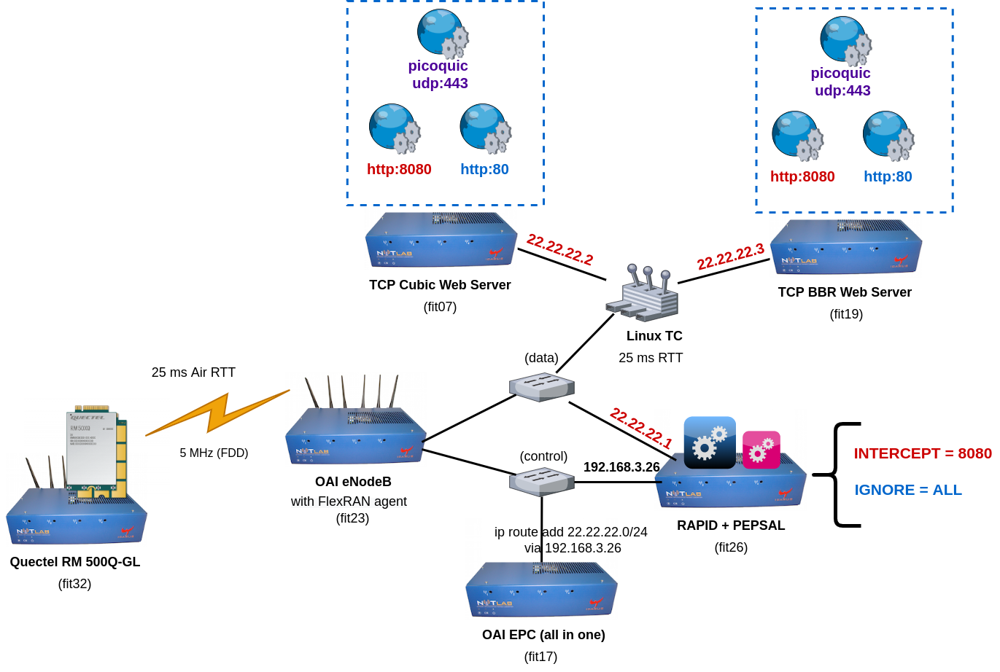

# RAPID-LINUX
RAPID implementation in Linux: Using pepsal for TCP-split and a new kernel module (rapid.ko) that implements RAPID's algorithms

<br/>
# 1. Subscribing to FlexRAN RNIS and Launching Pepsal

## 1.1 Subscribing to FlexRAN RNIS

From the faraday gateway, connect to the RAPID node (fit26) via the commands below: 

```
ssh root@fit26
python3 pub_stat.py

```
## 1.2 Launching Pepsal
Open another terminal on the faraday gateway and run the commands below:

```
ssh root@fit26
pepsal -d -v /root/peplog.log
```
# 2. Launching normal http traffic from Quectel UE

## 2.1. Recording CWND and RTT traces on the Cubic and BBR end servers
Connect to the end servers (fit07 and fit19). Then launch the script that records CWND and RTT traces on both of them:

```
ssh root@fit07
./getRTT.sh 192.168.3.17
```

On another terminal :

``` 
ssh root@fit19
./getRTT.sh 192.168.3.17 

```

## 2.2 Launch wget from the UE on port http port 80
Connect to the Quectel UE (fit32). Set up routes and download data from the Cubic and BBR server at the same time using wget. In this scenario, you have to use an HTTP port that is not intercepted by RAPID (i.e., 80 by default). 

```
ssh root@fit32
ip route add 22.22.22.0/24 dev wwan0
wget http://22.22.22.2:80/60M --report-speed=bits --delete-after -O /dev/null -o cubic.001.log & wget http://22.22.22.3:80/60M --report-speed=bits --delete-after -O /dev/null -o bbr.001.log

```
